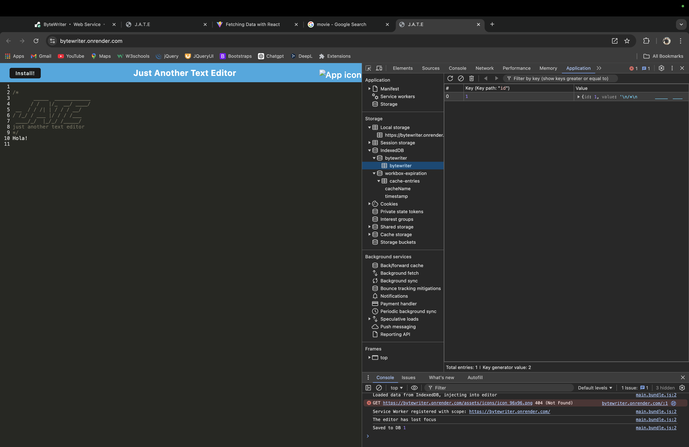

# ByteWriter - A Text Editor PWA

[](https://bytewriter.onrender.com/)

**Deployed Application**: [ByteWriter on Render](https://bytewriter.onrender.com)  
**GitHub Repository**: [ByteWriter Repo](https://github.com/Robert-Ulloa/ByteWriter)

## Description

ByteWriter is a Progressive Web Application (PWA) text editor designed to function both online and offline. It allows users to create and save notes or code snippets with or without an internet connection, ensuring content is reliably available. ByteWriter meets PWA criteria and leverages IndexedDB to persist data. This project started from a starter code provided by edX Boot Camps LLC, and has been customized and improved to add full PWA capabilities.

The application features:
- A fully functional text editor that saves content to IndexedDB when the user leaves the window.
- The ability to install the application as a desktop icon for quick access.
- A service worker for offline functionality, caching static assets, and efficient loading.
- Compatibility with modern JavaScript features like async/await.
- Deployed on [Render](https://bytewriter.onrender.com) with a fully working backend and client.

## Features

- **Offline functionality**: ByteWriter works seamlessly even without an internet connection.
- **IndexedDB for Data Storage**: Automatically stores user input and retrieves it when the app is reopened.
- **Service Worker**: Uses Workbox to precache static assets, improving load times and enabling offline use.
- **Installable PWA**: ByteWriter can be installed on your desktop or mobile device.
- **Bundled with Webpack**: JavaScript files are bundled using Webpack, and assets like HTML and manifest files are generated.
- **Cross-browser Compatibility**: Fully functional on all modern browsers.
  
## Technologies Used

- **Node.js** - Backend JavaScript runtime.
- **Express.js** - Web server framework.
- **Webpack** - Module bundler.
- **Babel** - Transpiling modern JavaScript.
- **IndexedDB** - Database for local storage.
- **Workbox** - Service worker management for caching and offline support.
- **idb** - A lightweight wrapper for IndexedDB.

## Installation

1. Clone the repository:
   ```bash
   git clone https://github.com/Robert-Ulloa/ByteWriter.git
   ```
2. Navigate to the root directory:
   ```bash
   cd ByteWriter
   ```
3. Install dependencies:
   ```bash
   npm install
   ```
4. Run the application:
   ```bash
   npm start
   ```

The app will be running on `http://localhost:3000`.

## Deployed Application

ByteWriter is deployed and accessible online via Render: [ByteWriter on Render](https://bytewriter.onrender.com)

## User Story

As a developer, I want to create notes or code snippets with or without an internet connection, so that I can reliably retrieve them for later use.

## Acceptance Criteria

- The application uses IndexedDB to store user input.
- The application works offline and can be installed as a PWA.
- JavaScript files are bundled using Webpack, and there is a generated service worker and manifest file.
- The application registers a service worker to cache static assets.
- The content is saved to IndexedDB and retrieved when the user revisits the app.

## Screenshots

### Before Installation:
Here is a screenshot of the ByteWriter application before installation:


### Installed:
Here is a screenshot of the ByteWriter application after installation:


### Manifest:
This screenshot shows the manifest file in the browser:


### Service Worker:
This screenshot shows the registered service worker:


### IndexedDB:
Here is a screenshot of the IndexedDB storage:



## Questions
  For any questions, please contact me with the information below:
  
  GitHub: [Robert-Ulloa](https://github.com/Robert-Ulloa)
  
  Email: [roanuc8@gmail.com](mailto:roanuc8@gmail.com)
  
  LinkedIn: [https://www.linkedin.com/in/roberto-ulloa-30135b317/ ](https://www.linkedin.com/in/roberto-ulloa-30135b317/ )

## License and Credits

This project includes code from the starter code by © 2024 edX Boot Camps LLC. Confidential and Proprietary. All Rights Reserved. I modified and improved it to make the app fully functional as a PWA.

Special thanks to ChatGPT, which helped explore better code options and troubleshoot errors.
As well I took the miniproject of the week as a reference for this Activity.

